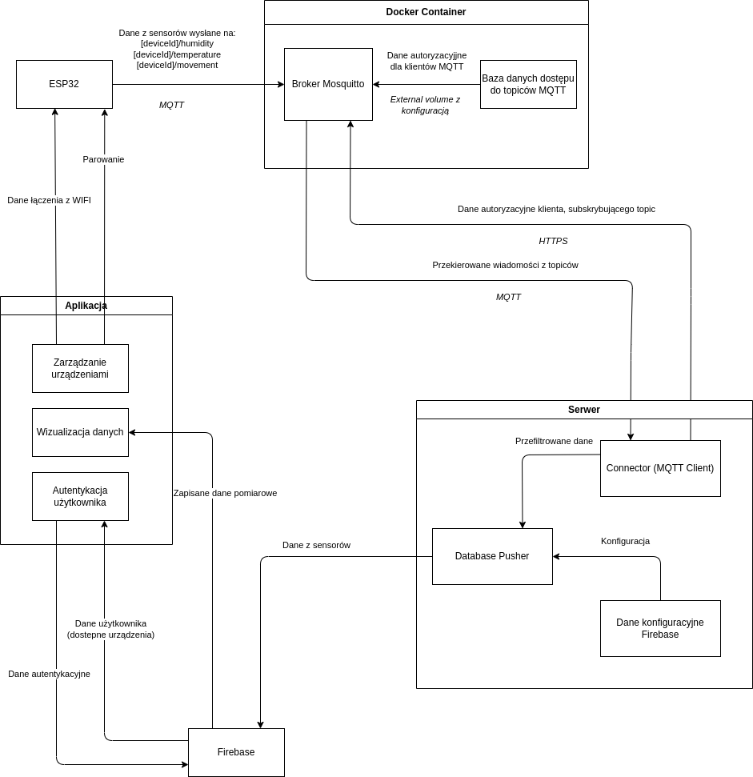
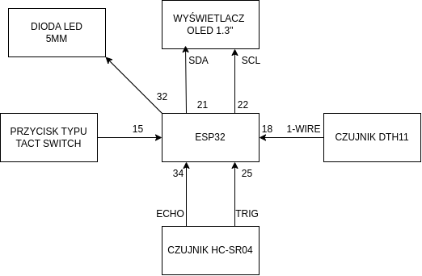

## Raport z projektu Internet Rzeczy i Inteligentne Systemy Wbudowane
**Wiktor Prosowicz, Jakub Pietrzko, Jan Stryszewski**

### Przepływ danych z płytki ESP32

- Płytka zebrane dane wysyła na odpowiedni topic MQTT o zdefiniowanej nazwie dla danego urządzenia (np. device1/temperature)
- Dane autoryzacyjne płytki jako klienta MQTT zależą są niedostępne i wszyte w zkompilowany kod płytki
- Broker Mosquitto, działający wewnątrz kontenera Dockerowego, zbiera dane z topiców i przekazuje je do klientów subskrybujących tj. serwera
- Serwer rozpoznaje rodzaj pomiaru i autora za pomocą nazwy topicu i odsyła je do serwera Firebase, który zapisuje je w bazie
- Dane z Firebase pobierane są przez aplikację

### Przepływ danych konfiguracyjnych z aplikacji do płytki

- Aplikacja wysyła Proof of Possession, SSID i hasło przez Bluetooth w celu udostępnienia płytce danych do łączenia z WIFI
- Aplikacja wysyła Proof of Possession do płytki przez Bluetooth w celu sparowania z płytką i dodania jej do urządzeń przypisanych do użytkownika

### Wykorzystane podzespoły do budowy urządzenia IOT:
- Moduł ESP32 - moduł oparty na układzie ESP-WROOM-32, wyposażony w 30 pinów I/O oraz komunikację WiFi / Bluetooth LE.

- Płytka stykowa 830 pól - duża płytka z osobnymi liniami zasilania umożliwiająca tworzenie układów elektronicznych.

- Czujnik DTH11 - czujnik umożliwiający pomiar temperatury i wilgotności.
- Ultradźwiękowy czujnik odległości HC-SR04 - czujnik umożliwiający pomiar odległości w zakresie od 2 cm do 200 cm.
- Wyświetlacz OLED - ekran o przekątnej 1,3" pozwalający np. wyświetlać dane z czujników.
- Przyciski typu tact switch
- Dioda LED 5mm
- Przewody połączeniowe źeńskie i męskie.
- Rezystor 330Ω i 4,7kΩ

### Protokoły komunikacyjne

- #### WIFI
    Do łączenia ESP32 z siecią lokalną i internetem. Wykorzystywane do przesyłania danych pomiarowych do serwera MQTT oraz do odbierania konfiguracji sieci Wi-Fi podczas procesu provisioning.

- #### Bluetooth Low Energy (BLE)
    Używane w procesie provisioning (konfiguracji Wi-Fi), umożliwiającym bezprzewodowe przesyłanie danych konfiguracyjnych Wi-Fi do urządzenia ESP32 za pomocą aplikacji mobilnej.

- #### MQTT (Message Queuing Telemetry Transport)
    Protokół komunikacyjny oparty na modelu publikuj/subskrybuj, używany do przesyłania danych pomiarowych z ESP32 do brokera MQTT.

- #### One Wire
    rotokół komunikacyjny używany do odczytu danych z czujnika temperatury i wilgotności DHT11. Pozwala na komunikację z czujnikiem za pomocą jednego przewodu do transmisji danych.

- #### I2c
    Protokół komunikacyjny wykorzystywany do sterowania wyświetlaczem OLED. Umożliwia komunikację między mikrokontrolerem ESP32 a wyświetlaczem przy użyciu dwóch linii: SDA (dane) i SCL (zegar).

### Główne Funkcje

- #### Inicjalizacja i Konfiguracja
    Kod rozpoczyna się od inicjalizacji NVS (Non-Volatile Storage) do przechowywania danych konfiguracyjnych, inicjalizacji interfejsów sieciowych, a także od konfiguracji Wi-Fi i klienta MQTT. Przy pierwszym uruchomieniu, jeśli urządzenie nie jest jeszcze skonfigurowane, uruchamiany jest proces provisioning za pomocą BLE, pozwalający użytkownikowi na przekazanie danych sieci Wi-Fi.

-  #### Obsługa Wi-Fi
    Zaimplementowano funkcje do obsługi zdarzeń Wi-Fi, takich jak start połączenia, rozłączenie i ponowne łączenie w przypadku utraty połączenia.

- #### Publikacja danych przez MQTT
    Utworzono funkcję `mqtt_publish`, która umożliwia publikację pomiarów temperatury, wilgotności oraz danych o ruchu na określonych topicach MQTT.

- #### Czujnik Temperatury i Wilgotności DHT11
    W funkcji `dht_test` cyklicznie odczytywane są dane z czujnika DHT11 i publikowane za pomocą MQTT. Dodatkowo, informacje te wyświetlane są na ekranie OLED za pomocą interfejsu I2C.

- #### Wykrywanie Ruchu
    Implementacja `ultrasonic_sensor_task` wykorzystuje czujnik ultradźwiękowy do wykrywania ruchu. Gdy wykryty ruch przekracza ustalony próg, informacja o ruchu publikowana jest na serwer MQTT, a także aktywowany jest buzzer jako sygnał alarmowy.

- #### Resetowanie Konfiguracji
    Przycisk resetujący pozwala na szybkie usunięcie zapisanych ustawień Wi-Fi i ponowne uruchomienie procesu provisioning.

### Podsumowanie
Kod stanowi kompleksowe rozwiązanie do monitorowania serwerowni za pomocą ESP32 i komunikacji z serwerem MQTT. Wykorzystuje on różnorodne technologie komunikacyjne i sensory, oferując szerokie możliwości aplikacji IoT.

